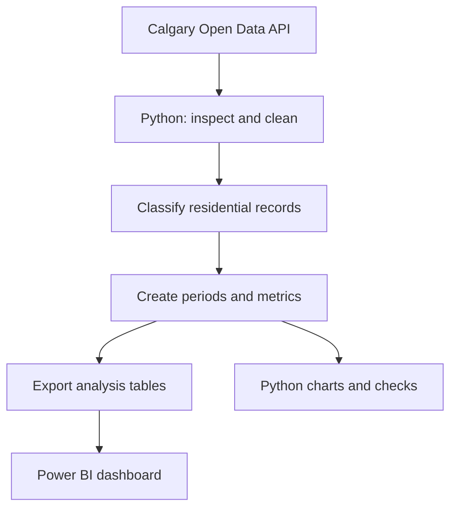

# Calgary Development Permit Activity

**DATA 110 Mini-Capstone Project**

This project examines how Calgary residential development-permit activity differed before and during the city's citywide rezoning period. It uses Python for data acquisition, cleaning, transformation, and exploratory analysis, then Power BI for interactive reporting.

The project studies **observable differences and associations**. It does not claim that rezoning caused every change in permit activity.

## Copyright and academic integrity

Copyright © 2026 Albert Leung. All rights reserved.

This repository contains an original academic project. It may be viewed for reference, but its original code, documentation, analysis, visualizations, Power BI materials, and presentation materials may not be copied, modified, or submitted for academic credit without prior written permission.

See the [copyright notice](LICENSE.md) and [academic integrity policy](ACADEMIC_INTEGRITY.md). City of Calgary source data is separately licensed under the Open Government Licence – City of Calgary and is not covered by this project's copyright restrictions.

## Research question

> What differences in Calgary residential development-permit activity can be observed before and during citywide rezoning?

The analysis focuses on six supporting questions:

1. Did monthly residential development-permit volume differ between the two periods?
2. Did the mix of residential development types change?
3. Which communities experienced the largest absolute and percentage changes?
4. Did typical processing time differ?
5. Did the share of rezoning-relevant residential permits change?
6. How did permit activity vary by season within each policy period?

## Study periods

The primary comparison uses two nearly equal periods and classifies permits by `AppliedDate`.

| Period | Start | End | Use in analysis |
|---|---:|---:|---|
| Before rezoning | 2022-08-06 | 2024-08-05 | Primary comparison |
| During rezoning | 2024-08-06 | 2026-08-03 | Primary comparison |
| Early post-repeal | 2026-08-04 | Latest available date | Context only; incomplete |

August 6, 2024 is the implementation date for Bylaw 21P2024. Calgary's repeal-related zoning changes took effect on August 4, 2026. The short post-repeal period is not treated as equivalent to the two primary periods.

## Data source

The primary source is the City of Calgary's [Development Permits](https://data.calgary.ca/Business-and-Economic-Activity/Development-Permits/6933-unw5) open dataset.

- Dataset ID: `6933-unw5`
- Publisher: The City of Calgary
- Unit of observation: one development-permit application
- Unique identifier: `PermitNum`
- Access: Socrata Open Data API and downloadable CSV
- API endpoint: `https://data.calgary.ca/resource/6933-unw5.json`

Important fields include application, decision and release dates; category and proposed use; land-use district; permit status and decision; community and ward; and latitude/longitude.

## Planned workflow



Python and Power BI serve different roles while using the same definitions:

- **Python:** retrieve, profile, clean, classify, validate, summarize, visualize, and export the data.
- **Power BI:** provide interactive comparisons by period, community, ward, permit type, status, and land-use district.

Socrata results can be saved as CSV, JSON, or GeoJSON by filename extension, or as Parquet when a compatible engine is installed. Project settings can request CSV, JSON, JGeoJSON, and/or Parquet storage for raw snapshots and processed outputs. The file writer uses interchangeable format adapters and can load a custom adapter through a validated Python class path; see [Python Design Patterns](docs/DESIGN_PATTERNS.md).

## Key measures

- total and monthly residential permit counts;
- average and median monthly permit counts;
- absolute and percentage change between periods;
- development-type count and share;
- permit counts and processing measures by season;
- median processing days and interquartile range;
- rezoning-relevant permits as a share of residential permits;
- community-level change, with small-base warnings for percentage change.

Processing time is defined initially as:

```text
ProcessingDays = DecisionDate - AppliedDate
```

Only non-negative values with both dates present will be included in processing-time summaries. This rule will be checked against the actual data before results are reported.

### Seasonal classification

Each permit will also be classified from `AppliedDate` using meteorological seasons:

| Season | Months |
|---|---|
| Fall | September–November |
| Winter | December–February |
| Spring | March–May |
| Summer | June–August |

Winter crosses calendar years. For example, December 2024 through February 2025 will be labelled **Winter 2024–25**. A season start date and sort key will keep seasons in chronological order in Python and Power BI. Seasons cut by the study boundaries will be flagged as partial rather than compared as though they contained three complete months.

## Repository structure

```text
Data110_DP_Activity/
├── ACADEMIC_INTEGRITY.md
├── LICENSE.md
├── README.md
├── config/
│   ├── settings.yaml             # project-wide analysis settings
│   └── classification_rules.csv # ordered housing-form classification rules
├── docs/
│   ├── CONFIGURATION.md
│   ├── DATA_DICTIONARY.md
│   ├── DESIGN_PATTERNS.md
│   ├── BIAS_AND_MITIGATION.md
│   ├── DEVELOPMENT_PERMIT_BACKGROUND.md
│   ├── METHODOLOGY.md
│   ├── POWER_BI_PLAN.md
│   ├── PRESENTATION_PLAN.md
│   ├── PROJECT_SUMMARY.md
│   ├── REFERENCES.md
│   └── TESTING.md
├── data/
│   ├── raw/                 # downloaded source data; not committed
│   └── processed/           # cleaned Power BI inputs
├── notebooks/               # optional exploration notebooks
├── powerbi/                 # Power BI .pbix file
├── reports/                 # final summary and presentation exports
├── requirements-dev.txt     # pinned local testing dependencies
├── src/                     # reusable Python modules
└── tests/                   # pytest tree mirroring the Python modules
```

Folders and planned files shown above that are not yet present will be added as the analysis is implemented.

## Configuration

Analysis choices are kept outside the Python code where practical. [`config/settings.yaml`](config/settings.yaml) contains the data source, study periods, season definitions, quality checks, storage formats, output naming and overwrite behavior, and pipeline-log archive settings. [`config/classification_rules.csv`](config/classification_rules.csv) contains ordered, auditable rules for residential inclusion, housing type, and rezoning-relevance classification. Provisional, fallback, and review rules remain subject to the validation process; being committed does not magically make a rule correct.

See the [configuration and classification-rules guide](docs/CONFIGURATION.md) for the file schemas, validation requirements, rule precedence, and audit process.

The Python modules also identify their architectural or object-oriented pattern and explain why it is used. See the [Python Design Patterns](docs/DESIGN_PATTERNS.md) overview for how the adapters, repositories, pipeline, strategies, rule chain, factories, and functional feature stages fit together.

## Getting started

The executable analysis has not been added yet. Once implemented, the intended setup will be:

```bash
git clone https://github.com/alby1976/Data110_DP_Activity.git
cd Data110_DP_Activity
python -m venv .venv
```

Activate the environment on Windows PowerShell:

```powershell
.venv\Scripts\Activate.ps1
```

Then install the pinned dependencies and run the analysis commands documented in a future reproducibility section. Commands will not be advertised as working until the corresponding files exist.

## Running the tests

Install the development dependencies and run the complete suite from the repository root:

```bash
python -m pip install -r requirements-dev.txt
python -m pytest -q
```

Tests for unfinished pseudocode appear as `XFAIL`. This is expected while a function still
raises `NotImplementedError`. After you implement a function, its real assertions run:

- `.` means the behavior passed;
- `F` means the implementation returned a result but did not meet the expected behavior;
- `XFAIL` means that module still reaches a `NotImplementedError` placeholder.

This makes the test summary a progress checklist rather than treating unfinished modules as
completed work.

The full framework, test layers, implementation loop, fixture rules, and completion gates are
defined in the [Testing Framework](docs/TESTING.md).

## Documentation

- [Copyright notice](LICENSE.md)
- [Academic integrity policy](ACADEMIC_INTEGRITY.md)
- [Configuration and classification-rules guide](docs/CONFIGURATION.md)
- [Python design patterns](docs/DESIGN_PATTERNS.md)
- [Implementation plan](docs/IMPLEMENTATION_PLAN.md)
- [One-page project summary](docs/PROJECT_SUMMARY.md)
- [Biases and mitigation plan](docs/BIAS_AND_MITIGATION.md)
- [Development permit background](docs/DEVELOPMENT_PERMIT_BACKGROUND.md)
- [Methodology and analysis rules](docs/METHODOLOGY.md)
- [Data dictionary](docs/DATA_DICTIONARY.md)
- [Power BI dashboard plan](docs/POWER_BI_PLAN.md)
- [Presentation plan](docs/PRESENTATION_PLAN.md)
- [Testing framework](docs/TESTING.md)
- [References and related work](docs/REFERENCES.md)

## Limitations

- This is an observational before/during comparison, not a causal study.
- Interest rates, population, construction costs, housing demand, seasonality, and other policies changed during the study.
- Public permit descriptions may require transparent rule-based classification.
- An application can begin in one policy period and be decided in another.
- Current status fields can change after data is downloaded.
- Percentage changes can be misleading when a community has a small baseline count.
- The early post-repeal period is incomplete and is presented only as context.

The analysis will use a documented [bias and mitigation plan](docs/BIAS_AND_MITIGATION.md). Planned safeguards include freezing a reproducible data snapshot, validating classification rules against samples, separating applications from approvals and completed homes, reporting missingness and pending cases, comparing like months and complete seasons, showing denominators, and testing whether conclusions change under reasonable alternative definitions. These steps can reduce bias; they cannot turn an observational comparison into a causal experiment.

## Official references

- [City of Calgary Development Permits dataset](https://data.calgary.ca/Business-and-Economic-Activity/Development-Permits/6933-unw5)
- [Land Use Bylaw 1P2007 and Bylaw 21P2024](https://www.calgary.ca/planning/land-use/online-land-use-bylaw.html?sec=21P2024)
- [Citywide rezoning repeal and timeline](https://www.calgary.ca/planning/projects/rezoning.html)
- [Planning application statistics](https://www.calgary.ca/planning/application-statistics.html)
- [CMHC: Land Use Regulations and the Impact on Housing in Canada](https://www.cmhc-schl.gc.ca/professionals/housing-markets-data-and-research/housing-research/research-reports/accelerate-supply/land-use-regulations-impact-housing-canada)

## Project status

**Planning and documentation.** The research design is defined; data profiling, classification validation, Python analysis, Power BI development, and result writing remain to be completed.

## Author

Albert Leung

DATA 110 Mini-Capstone
