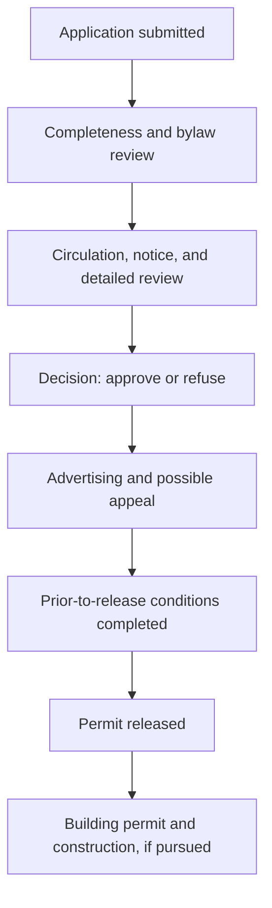

# Background: Calgary Development Permits

This document provides the planning background needed to interpret Calgary's development-permit data correctly. It is a plain-language analytical guide, not a legal interpretation of the Land Use Bylaw.

## What is a development permit?

A development permit (DP) is a planning approval used to determine whether a proposed development complies with Calgary's Land Use Bylaw and applicable planning policies. Calgary divides land into districts, commonly called zones, and each district establishes allowed uses and development rules.

A DP review can consider matters such as:

- whether the proposed use is allowed in the district;
- building placement, height, massing, setbacks, density, parking, and site design;
- applicable statutory plans, policies, bylaws, and design guidelines;
- the surrounding context;
- technical reviews and comments from affected parties;
- public comments when the application includes a commenting opportunity.

Not every project requires a DP. The Land Use Bylaw identifies exemptions. This means the open DP dataset represents applications that entered the development-permit system, not every renovation, building project, or change occurring in Calgary.

## Four concepts that should not be confused

| Concept | Main question | Decision or result |
|---|---|---|
| Land-use district or zoning | What uses and development rules apply to this parcel? | Existing district under the Land Use Bylaw |
| Land-use redesignation | Should the parcel's district be changed? | Council decision following its statutory process |
| Development permit | Is this proposed use and design acceptable under the applicable planning rules and policies? | Approval, approval with conditions, or refusal |
| Building permit | Does the proposed construction comply with applicable building-safety requirements? | Authorization for regulated construction work |

A zoning change does not itself approve a particular building. Conversely, a development permit is not a building permit and does not prove that construction started or finished.

## Why Calgary adopted citywide or “blanket” rezoning

“Blanket rezoning” is the common political and public term for what the City generally called **citywide rezoning** or **Rezoning for Housing**. It did not mean that every parcel could be developed without rules or approval. It changed the land-use districts applying to many low-density residential parcels while leaving the development-permit process in place.

Council approved citywide rezoning on May 14, 2024 as one of 98 actions in *Home is Here: The City of Calgary's Housing Strategy*. According to the City's stated rationale, the policy was intended to respond to Calgary's housing crisis by:

- enabling more housing supply;
- allowing a wider choice of low-density housing forms;
- reducing the need for a separate parcel-by-parcel land-use redesignation before certain housing proposals could be considered;
- removing regulatory barriers and uncertainty;
- reducing time and cost involved in bringing housing proposals forward;
- continuing to evaluate the actual project design through the development-permit process.

The change allowed more low-density housing choices—including single-detached, semi-detached, rowhouse, and townhouse forms—to be considered in new and established communities, subject to the rules of the applicable district and the DP review. In practical terms, it changed the question from:

> Should this individual parcel first be rezoned before this housing form can even be considered?

to:

> Does this particular proposal satisfy the applicable district rules and planning review?

That distinction is central to this project. Citywide rezoning reduced a zoning barrier for certain proposals; it did not guarantee a development permit, waive design rules, eliminate public input, authorize construction, or ensure that approved projects would be built.

### Policy timeline used by this project

| Date | Significance |
|---|---|
| May 14, 2024 | Council approved citywide rezoning with amendments |
| August 6, 2024 | The new land-use designations took effect |
| April 8, 2026 | Council approved repeal, but existing zoning remained in force during implementation |
| August 4, 2026 | Repeal-related zoning changes took effect, subject to exemptions and other approved amendments |

### Intended purpose is not a measured result

The statements above describe the City's policy rationale. They are not findings of this capstone. The analysis must separately test whether development-permit volume, housing-form mix, processing time, seasonality, and geographic distribution differed during the policy period.

Even if permit activity increased, the dataset alone cannot establish that citywide rezoning caused the increase. Conversely, a lack of immediate increase would not prove that the policy had no effect, because planning, financing, approval, and construction operate on different timelines.

## Typical development-permit lifecycle

The City's public process can be simplified into the following analytical stages:

Actual applications do not all follow an identical path. Some may not require every form of notice or circulation, applicants may revise plans, decisions may be appealed, conditions can delay release, and approved projects may never proceed to construction.

### 1. Application submitted

The City receives the application and performs an initial review. In this project, `AppliedDate` is used to assign the permit to the Before, During, or Early Post-Repeal policy period because it best represents when the formal application entered the system.

### 2. Under review

The City may perform a bylaw review, circulate the application to internal or external parties, post notice, receive public comments, visit the site, and request revisions or additional information from the applicant.

Public commenting is not identical for every DP. The City's process page states that notice and circulation depend on the application, use, district, and stage. Therefore, the presence or absence of public comments should not be interpreted as a simple measure of public interest.

### 3. Decision

The development authority—City Administration or, for some matters, the Calgary Planning Commission—decides whether to approve or refuse the application. `DecisionDate` records this milestone where it is available.

A decision date is not the same as a release date. An approval may still be subject to advertising, appeal, and prior-to-release conditions.

### 4. Advertising and appeal

Many approved permits are advertised and may be appealed by affected parties during the applicable appeal period. The City's current public guidance describes a 21-day period. Permitted-use DPs that conform to all Land Use Bylaw rules are treated differently: the City states that they are not advertised and the decision cannot be appealed.

Appeal information in the dataset must be interpreted separately from the original City decision. An appeal board can uphold, vary, or overturn a decision.

### 5. Permit release

A permit is released after applicable requirements are satisfied and, where relevant, the appeal process is resolved. `ReleaseDate` is therefore a later milestone than approval for many records.

Release still does not establish that construction started. The applicant may need a building permit, financing, contractors, or other approvals, and the project may never proceed.

## Permitted and discretionary uses

A permitted use is one the district lists as permitted. A discretionary use requires the development authority to exercise planning judgment under the Land Use Bylaw and applicable policies.

The label does not mean that every permitted-use application is automatically approved. The proposal must still satisfy the applicable rules, or any requested relaxation must be considered. Discretionary applications generally require more review and may require circulation, advertising, and an appeal period.

For this project, `PermittedDiscretionary` can be used as an analytical category, but it should not be treated as a measure of project quality or controversy.

## Current City timeframes versus measured processing time

The City's Development Map guidance currently lists target decision timeframes that vary by application type, including 90–120 days for houses, 7–14 days for permitted changes of use, 60 days for certain discretionary or relaxation applications, and 120 days for other DPs. Some files use customized timelines.

These are current service targets, not guaranteed completion times and not necessarily the targets that applied throughout the study period. The project will calculate observed processing time from the dataset and will not label every application exceeding a current target as delayed.

## How the dataset represents the process

| Dataset field | Planning meaning | Interpretation caution |
|---|---|---|
| `PermitNum` | application identifier | count distinct permits, but one permit is not necessarily one physical project or dwelling |
| `AppliedDate` | formal application date | does not show when project planning began |
| `DecisionDate` | date of the development authority's decision | not the same as permit release or construction start |
| `ReleaseDate` | date the permit was released | release does not prove construction occurred |
| `MustCommenceDate` | deadline by which development must commence | does not confirm that commencement happened |
| `StatusCurrent` | status when the data was retrieved | mutable; later downloads may show a different status |
| `Decision` | recorded decision outcome | should be analyzed separately from current status and any appeal outcome |
| `SDABDecision` | appeal outcome where recorded | applies only to appealed cases with available data |
| `Category` | City application category | categories may not map cleanly to housing form |
| `ProposedUseDescription` | proposed land use or uses | may contain multiple semicolon-separated values |
| `LandUseDistrict` | district recorded at application | may contain multiple values and does not reconstruct every historical parcel change |
| `LocationCount` | number of associated locations | one permit may involve multiple addresses or parcels |
| `CommunityName` and `Ward` | geographic classifications | ward boundaries can change; community is generally more stable for longitudinal comparison |

## What this project can measure

The dataset can support analysis of:

- submitted permit volume over time;
- recorded application categories and proposed uses;
- permitted versus discretionary classification;
- decisions, current statuses, and releases where recorded;
- observed application-to-decision intervals;
- community and ward patterns;
- geographic distribution using published coordinates;
- applications associated with selected land-use districts or residential forms.

## What this project cannot establish by itself

The DP dataset does not, on its own, establish:

- the number of dwellings ultimately constructed;
- construction starts or completions;
- whether an approved project was financially viable;
- the complete cost of development;
- why an applicant chose to apply;
- what would have happened without citywide rezoning;
- whether rezoning caused a change observed in the data.

Those questions require additional data or a stronger causal research design. Calling an application a completed home would be a category error wearing a hard hat.

## Relevance to the rezoning comparison

Citywide rezoning changed the land-use framework under which many residential proposals could be considered. It did not guarantee approval, remove the DP process, or convert applications into completed housing.

This project therefore measures **development-permit activity before and during the policy period**. It uses application date as the primary policy-period boundary, then separately examines decisions, releases, processing time, development type, season, and geography. Conclusions will describe differences and associations rather than claim that the zoning policy alone caused them.

## Official sources

1. City of Calgary. [Development Permit Process](https://www.calgary.ca/development/permits/process.html).
2. City of Calgary. [How the Process Works](https://www.calgary.ca/development/permits/dmap-process.html).
3. City of Calgary. [Land Use Bylaw 1P2007](https://www.calgary.ca/planning/land-use/online-land-use-bylaw.html).
4. City of Calgary. [Development Permits open dataset](https://data.calgary.ca/Business-and-Economic-Activity/Development-Permits/6933-unw5).
5. City of Calgary Newsroom. [City Council Approves Citywide Rezoning with Amendments in Response to Calgary's Housing Crisis](https://newsroom.calgary.ca/city-council-approves-citywide-rezoning-with-amendments-in-response-to-calgarys-housing-crisis/), May 14, 2024.
6. City of Calgary. [Repeal of Citywide Rezoning](https://www.calgary.ca/planning/projects/rezoning.html).

The City notes that its webpages are general information and do not have legal status. The applicable bylaws and official decisions govern individual applications.
